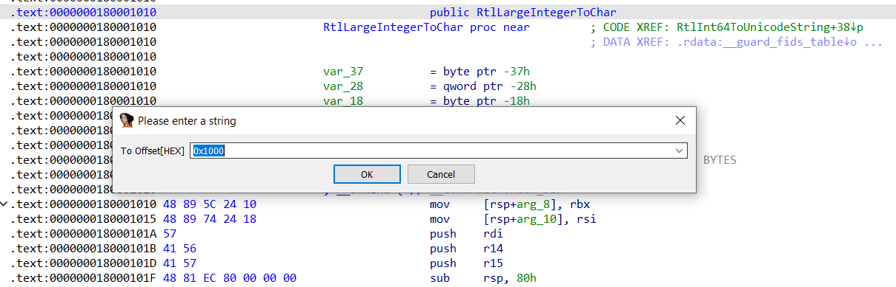
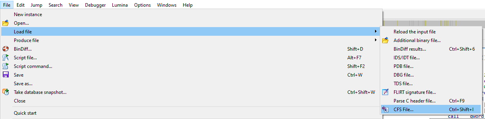

# IDA Plugins

This directory contains scriptable plugins for IDA. Drop them into your `IDA\plugins` directory to activate.

---------------

## [Get Address Offset Plugin](cvutils-getoffset.py)

This plugin allows you to do a very simple operation. Get the offset from the image base of the current cursor. 
Essentially it's copying to your clipboard the RVA. This is useful when you wish to jump to a *in-memory* live version of whatever you have dumped that is loaded inside IDA.

### **Usage Instructions:**

Right click anywhere in an IDA View and select **Get Offset**.
Alternatively you can use the shortcut command `Ctrl+Shift+C`
The offset will be copied to your clipboard.

## [Go To Offset Plugin](cvutils-gotooffset.py)

This plugin allows you to jump to an address location given an offset.

### **Usage Instructions:**

Press the shortcut command `Shift+G` to open the input dialog.
Input the offset you wish to jump to and press OK.

## [CFS Importer](cvutils-cfs-importer.py)

This plugin allows you to import Function Signatures that have been previously exported using the export plugin.
It esentially just does a binary search of each signature present in the .cfs file.If it finds a match it will rename the function at that location.

### **Usage Instructions:**

File->Load file->CFS File..
Select the .cfs file in the explorer window.

