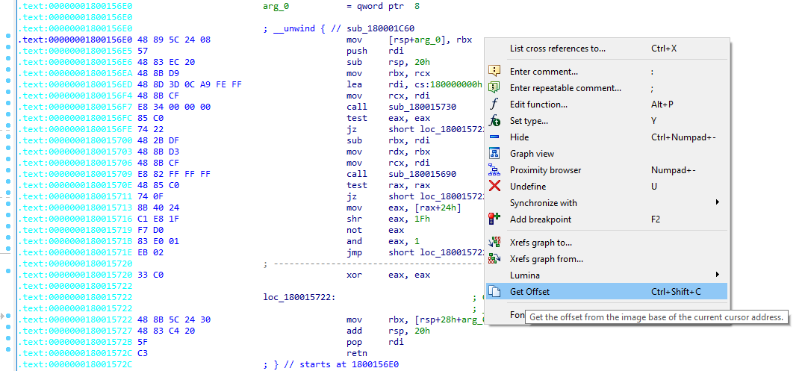

# IDA Plugins

This directory contains scriptable plugins for IDA. Drop them into your `IDA\plugins` directory to activate.

---------------

## [Get Address Offset Plugin](cvutils-getoffset.py)

This plugin allows you to do a very simple operation. Get the offset from the image base of the current cursor. 
Essentially it's copying to your clipboard the RVA. This is useful when you wish to jump to a *in-memory* live version of whatever you have dumped that is loaded inside IDA.

### **Usage Instructions:**

Right click anywhere in an IDA View and select **Get Offset**.
Alternatively you can use the shortcut command `Ctrl+Shift+C`
The offset will be copied to your clipboard.

## [Go To Offset Plugin](cvutils-gotooffset.py)

This plugin allows you to jump to an address location given an offset.

### **Usage Instructions:**

Right click anywhere in an IDA View and select **Get Offset**.
Press the shortcut command `Shift+G` to open the input dialog.
Input the offset to and press Ok.